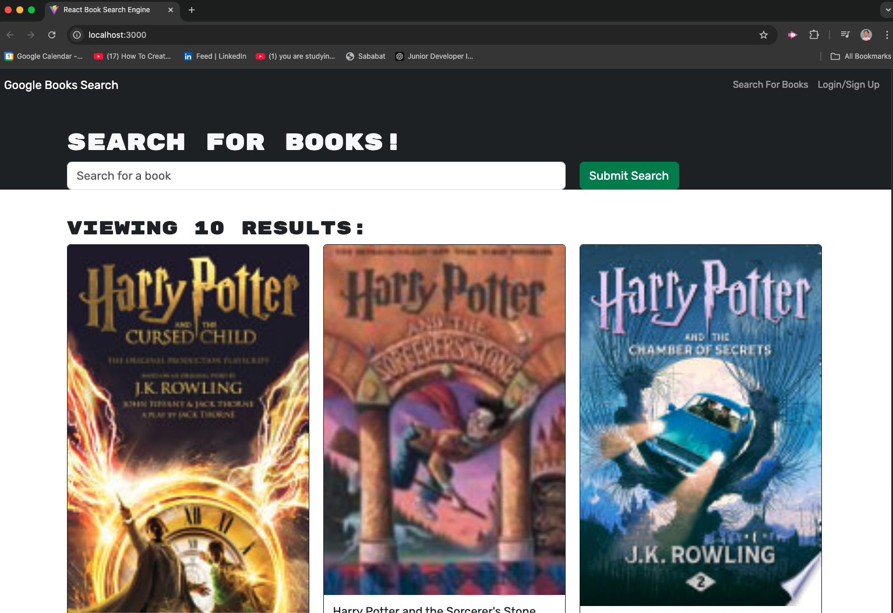

# Book-Search Engine

The Book Search Engine is an app that allows users to search for books, save their favorite books, and view them later. Originally built with a RESTful API, this app has been refactored to utilize a GraphQL API using Apollo Server. It is built with the MERN stack: MongoDB, Express.js, React, and Node.js. The app also supports user authentication, allowing users to sign up, log in, and save their book searches to their account.



## Getting Started
## Prerequisites

-Node.js and npm installed
-MongoDB Atlas account for database hosting
-Apollo Server and MongoDB libraries

## Installation

-Clone the repository:

git clone
cd 

## Install dependencies:

## server:
```
cd server
npm install
```

## client
```
cd client
npm install
```

## Set up MongoDB Atlas:

-Create a MongoDB Atlas cluster.

-Get the connection string and add it to .env files on both front and back ends.

## Run the app locally:

- Start the backend server:
  
```
cd server
npm start
```

-Start the frontend development server:

```
cd client 
npm run dev
```

## Deployment: 

-Go to Render
-Choose New Web Service
-Connect your repository
-Deploy from root directory 

```
npm install && npm run build
```
```
npm run start
````


Click Create Web Service to deploy your server.It is deployed in Render. Check out the live demo here: [Google Books App](https://book-search-engine-2-3.onrender.com)
  
## Contributing

Fork the repository

## License
This project is licensed under the MIT License - see the LICENSE file for details.
